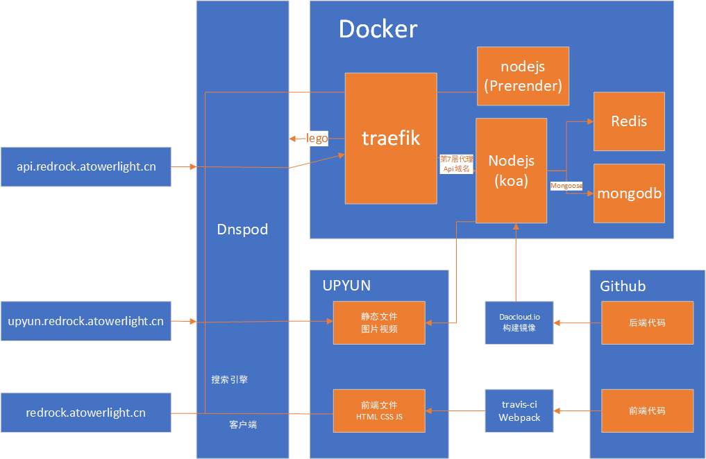

## 部署

不知道我这样使用直接外部的服务是否好，可能前期简单使用比较轻松，可能在之后高级使用的时候难度就会很大。

有以下特点：

1. 部分持续集成 (test 目前没写) -> daocloud.io & travis-ci
2. SSL 证书自动申请 (同时使用 dns-01 和 http-01 实现 CDN 和 原站相同域名都可用) -> lego & upyun
3. SEO 优化 如果是搜索引擎访问会将流量导到 prerender (因为 chrome headless 没安装成功，目前使用prerender 的服务器进行渲染，可用性不高)
4. 使用 treafik 替代 nginx 自动发现新的容器