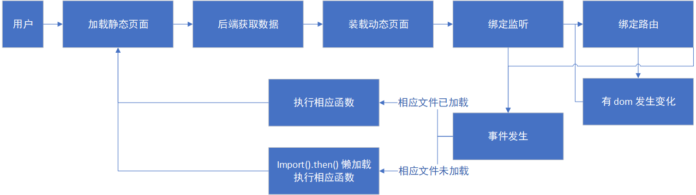
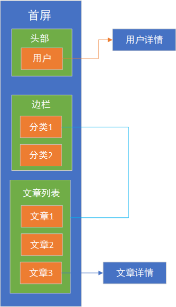

### SPA

微博最主要能干什么？发帖，看帖 而这些都能在首屏完成，所以我将网页的整体流程设计成这样：

#### 抽象的过程



#### 具体



概况：由于能力有限，现在实现的功能用事件监听就能做到。事实上我做的“路由”就是把事件监听的函数名改成链接，传递的参数就是链接中的参数，相应的 dom 变成了 a 标签。 

不足：
1. 由于不能对 dom 有好的管理（动态监听 dom 的变化，以最小的代价生成新页面）只能先删除后加载，所以用户点击前进后退的体验十分糟糕（如果要实现有良好的体验那么用现在的模式来做十分复杂）
2. 不能像 github 那样做到在后退前进时不重新请求 api，通过缓存加载


### 加载静态页面

```js
// ./index.js
import header from './view/header';
import indexBody from './view/indexBody';
import tips from './view/indexBody/tips'

...

function render() {
    document.body.appendChild(header());
    document.body.appendChild(indexBody());
    document.body.appendChild(tips());
}

...
```

其中的函数 header,indexBody,tips 返回的是相应静态的 dom 


### 后端获取数据

```js
// ./api/indexFirstLoad.js
import ajax from '../utils/ajax';
import nav from './header/nav';
import siderbar from './indexBody/siderbar'
import article from './indexBody/article'
import user from './indexBody/user'

export default async function() {
    await ajax('GET', '/api/index').then(result => {
        nav(result.data.link);
        siderbar(result.data.category);
        article(result.data.article);
        user(result.data.user)
    });
}
```

通过 ajax 将相应的 数据获取，然后传入相应函数加载


### 动态装载页面

```js
// api\acount\personBox.js

import compile from '../../utils/compile';

export default function (data) {
    const ele = document.querySelector('.personbox .box');
    ele.insertAdjacentHTML('beforeend', compile(`
        <div class="content">
            <input type="file" id="avatar-upload" class="hide" accept="image/*">
            <div class="avatar">
                <label for="avatar-upload">
                    
                </label>
            </div>
            <div class="text">
                <div class="name">
                
                </div>
                <div class="profile">
                
                    <span id="eidt-profile" class="editable"></span>
                
                    <span id="eidt-profile" class="editable">一句话介绍一下自己吧，让别人更了解你</span>
                
                </div>
            </div>
        </div>
        <div class="function">
            <div class="func-content favorite">
                <div>关注</div>
            </div>
            <div class="func-content article active">
                <div>帖子</div>
            </div>
        </div>

        <div class="person-article"></div>
        <div class="person-favorite hide"></div>
    `, data));
};
```

将相应的数据装载到模版中


### 绑定监听

入口文件

```js
// controllers\indexBody.js

import article from './indexBody/article'

export default function() {
    article()
}
```


相应的函数

```js
// controllers\indexBody\article.js

import article from '../../api/indexArticle'
import throttle from '../../utils/throttle'

let isHave = 1
let page = 1
export default function () {

    window.addEventListener('load', ()=>{
        isHave = 1
        page = 1
    })

    window.addEventListener('scroll', throttle(async function () {
        ....
    }, 500, 1000), false);


}

export { isHave, page }
```


### 绑定路由

```js
// routes\articleBox.js

import {articleBottomController} from '../controllers/article/articleBottom'

export default function(router){
    router.get('/article/:_id', (req) => {
        articleBottomController(req.params._id)
    })
}
```

如果符合 ```/article/:_id``` 这样的格式则会调用 `articleBottomController`函数并将 `:_id`传给函数


### DOM 变化

```js
// routes\index.js

const config = { attributes: false, childList: true, subtree: true };
const callback = records => {
	router.proxyLinks(records[records.length - 1].target.querySelectorAll('a')) // 记录最后一个，以防触到浏览器限制
    }
const observer = new MutationObserver(callback)
observer.observe(document.querySelector('body'), config);
```

使用 `MutationObserver` 来监听 DOM 的变化。并将 其中的 A 标签进行代理 （阻止默认行为并监听）


### 事件发生(未加载)

```js
// controllers\account\navbottom.js

export function registerBottomController() {
    import(/* webpackChunkName: "account" */ '../../less/account/common.less');
    import(/* webpackChunkName: "account" */ '../../view/account/registerBox').then(module => {
        const register = module.default;
        const registerEle = register();
        const body = document.querySelector('body');
        body.appendChild(registerEle);
        import(/* webpackChunkName: "account" */ './registerBox').then(module => {
            const registerController = module.default;
            registerController(body, registerEle)
        });
    });
}
```